## Table of Contents
Project
Objective
Links to Deployed Project
Project Structure
Developer User Stories
Profiles
Events
Followers
Search and Filter
Reviews
Database Design
Models
Features
Homepage
Profile Data
Events Data
Followers Data
Reviews Data
Agile Workflow
Github Project Board
Testing
Deployment
Credits

## Objective

## Links to Deployed Project

## User Stories and Tasks

## Database Schema
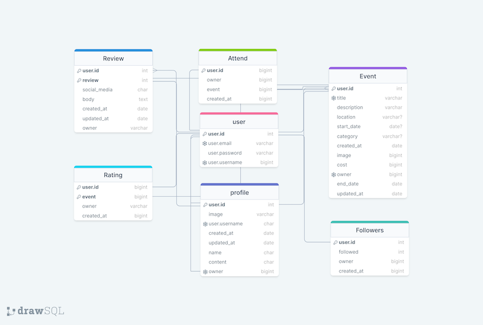

## Event model

owner = models.ForeignKey(User, on_delete=models.CASCADE)   
created_at = models.DateTimeField(auto_now_add=True)    
updated_at = models.DateTimeField(auto_now=True)    
title = models.CharField(max_length=255, blank=False)   
description = models.TextField(blank=False)   
start_date = models.DateTimeField(blank=False)
end_date = models.DateTimeField(blank=False)       
category = models.CharField(max_length=255, blank=False)    
location = models.CharField(max_length=255, blank=False)    
cost = models.DecimalField(max_digits=8, decimal_places=2)    
image = models.ImageField()    

## Profile model

owner = models.OneToOneField(User, on_delete=models.CASCADE)    
created_at = models.DateTimeField(auto_now_add=True)    
updated_at = models.DateTimeField(auto_now=True)    
name = models.CharField(max_length=255, blank=True)   
content = models.TextField(blank=True)    
image = models.ImageField()    

## Rating model

rating = models.IntegerField()    
event = models.ForeignKey(Event, on_delete=models.CASCADE, related_name='ratings')    
owner = models.ForeignKey(User, on_delete=models.CASCADE)   
created_at = models.DateTimeField(auto_now_add=True)  

## Review model

owner = models.ForeignKey(User, on_delete=models.CASCADE)    
review = models.ForeignKey(Event, on_delete=models.CASCADE)    
created_at = models.DateTimeField(auto_now_add=True)   
updated_at = models.DateTimeField(auto_now=True)   
body = models.TextField(blank=False)   
social_media = models.TextField()    

## Followers model

owner = models.ForeignKey(User, related_name='following', on_delete=models.CASCADE)     
followed = models.ForeignKey(User, related_name='followed', on_delete=models.CASCADE)     
created_at = models.DateTimeField(auto_now_add=True)     

## Attend model

owner = models.ForeignKey(User, on_delete=models.CASCADE)    
event = models.ForeignKey(Event, related_name='attend', on_delete=models.CASCADE)    
created_at = models.DateTimeField(auto_now_add=True)    

## Features

### Homepage.    
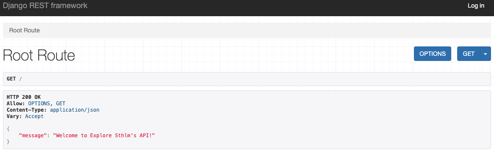    

### Profile Data.   
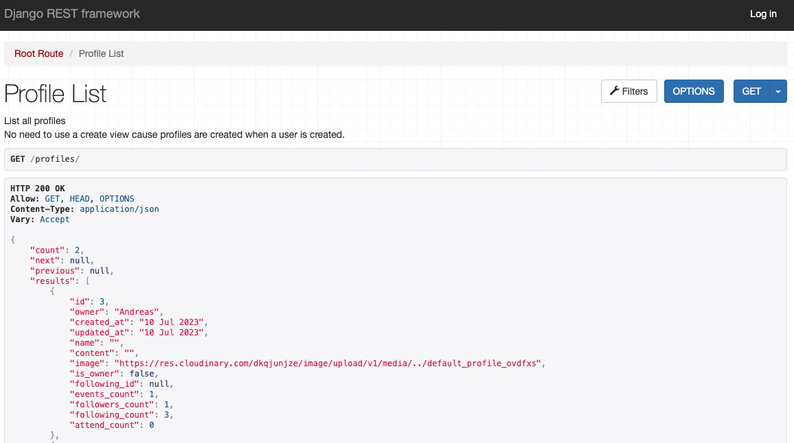   
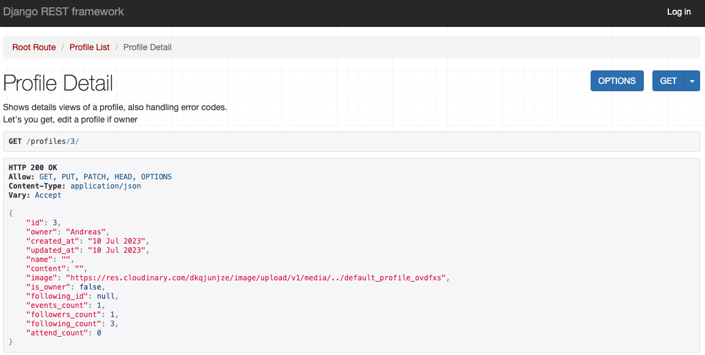   

### Events Data.   
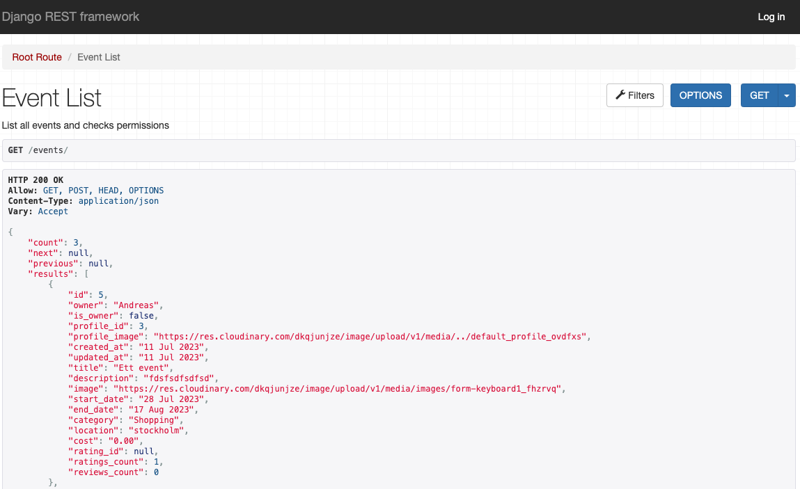    
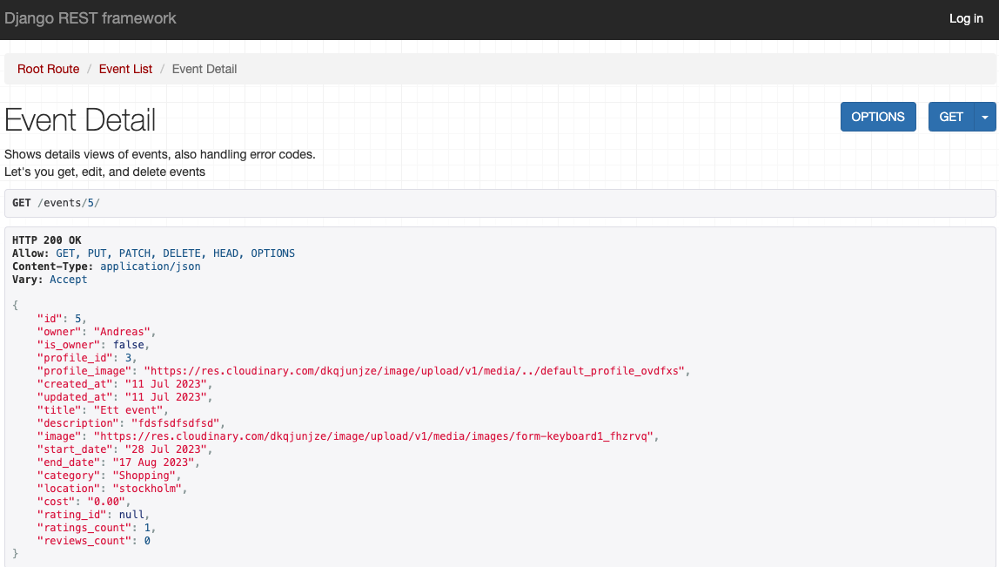    

### Reviews Data.    
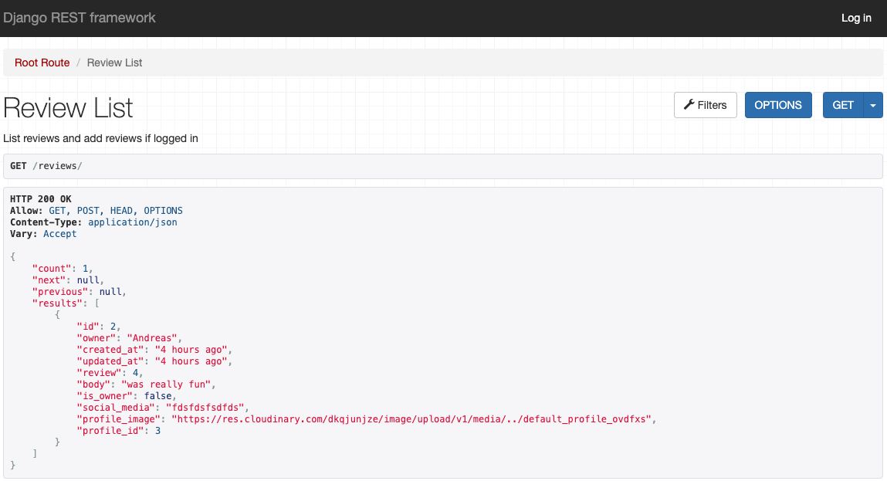   
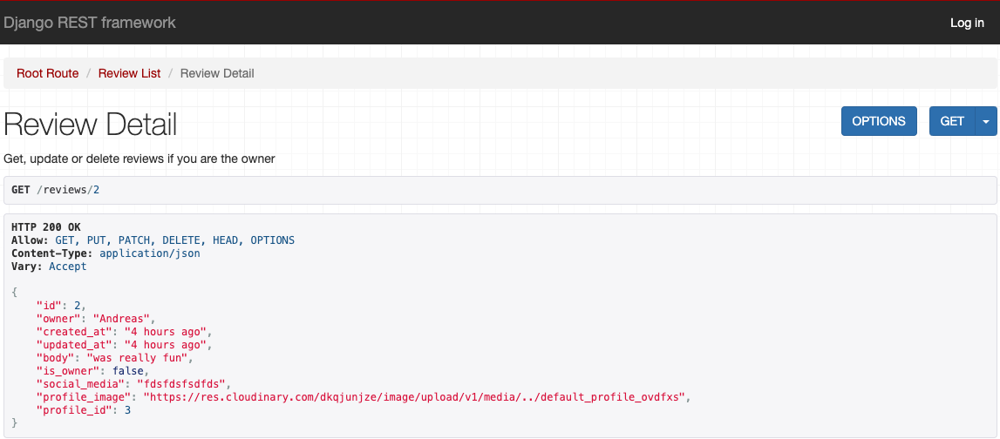    

### Attending Data.    
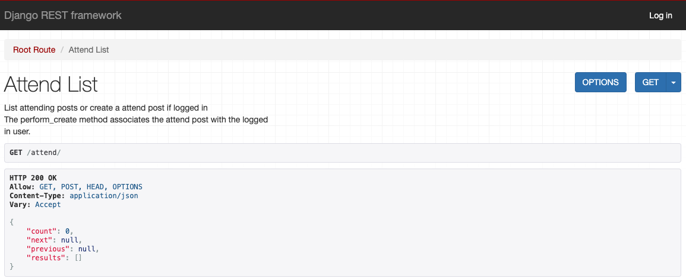    

### Ratings Data.   
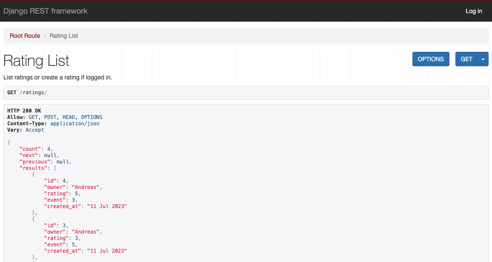    
   

### Followers Data.   
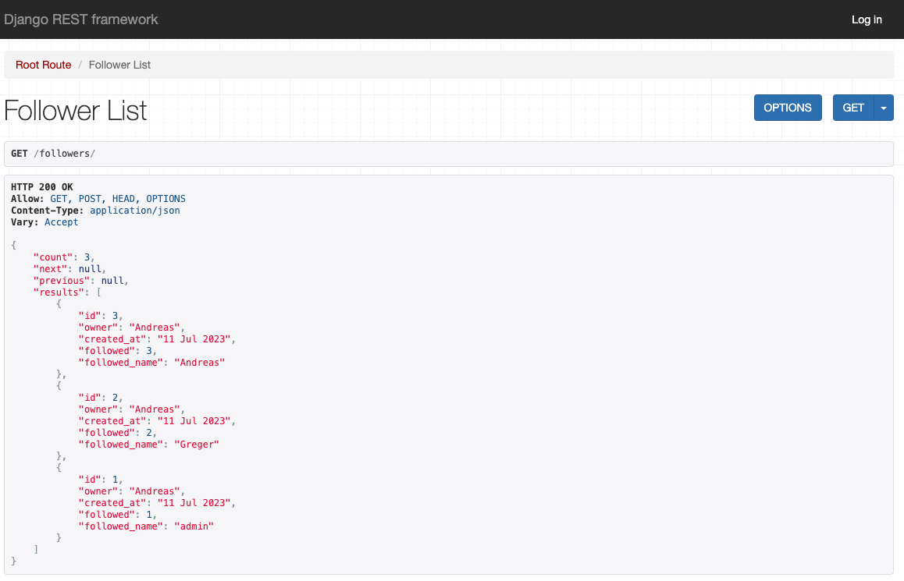   
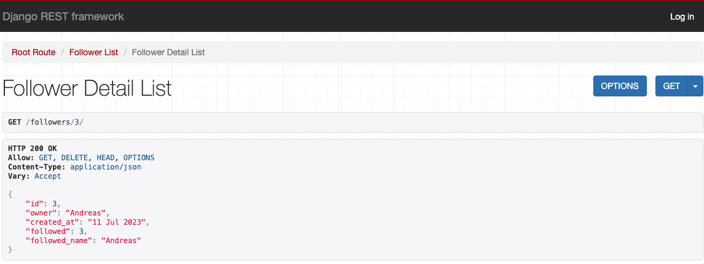   

## Agile Workflow
Github Project Board

## Testing

## Technologies Used
- ### Languages and frameworks

- ### Packages Used
    - cloudinary
    - cloudinary-storage
    - Pillow
    - django-rest-framework
    - dj-rest-auth
    - django-filter
    - django-allauth
    - PyJWT
    - psycopg2
    - gunicorn

- ### Programs and tools
    - drawSQL
    - GitPod for development
    - GitHub to store project

- ### Modules in GitPod Used
    - Prettier
    - eslint

## Deploying with Heroku

It's a prerequisite that you have Cloudinary account before deployment.
A Cloudinary account, create one for free at https://cloudinary.com.

1. Log in to Heroku and if not taken there automatically, navigate to your personal app dashboard.
2. At the top of the page locate the 'New' drop down, click it and then select 'Create new app'.
3. Give your application a unique name, select a region appropriate to your location and click the 'Create app' button.
4. Your app should now be created, so from the menu towards the top of the page select the 'Resources' section.
5. Search for 'Heroku Postgres' under the Add-ons section and add it.
6. From the menu towards the top of the page select the 'Settings' section and lick 'Reveal Config Vars' in the Config vars section. Enter the following key / value pairings:
- Key as ALLOWED_HOSTS and the value as the name of you project with '.herokuapp.com' appended to the end e.g. example-app.herokuapp.com. Click the Add button.
- Key as CLOUDINARY_URL and the value as your cloudinary API Environment variable e.g. cloudinary://**************:**************@*********. Click the Add button.
- Key as SECRET_KEY and the value as a complex string which will be used to provide cryptographic signing. The use of a secret key generator is recommended.
- Ensure the key DATABASE_URL is already populated. This should have been created automatically by Heroku.
- To make authenticated requests to this API (e.g. from a fontend application) you are required to add the key CLIENT_ORIGIN with the value set as the URL you will be sending the authentication request from.
- CLIENT_ORIGIN_DEV key can be set with the value of a development server (IP or URL) for use during local development.
7. Open the .env file in the project directory and delete the key / value pair DEV_ENVIRONMENT_DATABASE = True before saving the file. This can be added back after the next step to ensure local development changes will not alter the remote database.
8. Navigate to the 'Deploy' page using the menu towards the top of the page.
9. Select 'GitHub' from the 'Deployment method' section and you will be prompted to 'Connect to GitHub'.
10. Once connected to your GitHub account you will be able to search for your repository which contains the forked 'property-direct-backend' repository.
11. Once the repository is found click 'Connect'.
12. At the bottom of the page find the section named 'Manual deploy', select the 'main' branch in the drop down and click the 'Deploy' button.
13. Once deployment is complete, click the 'View' button to load the URL of the deployed application.
