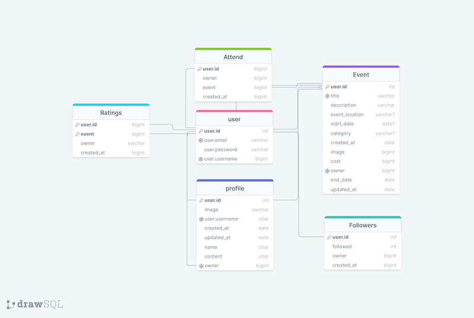
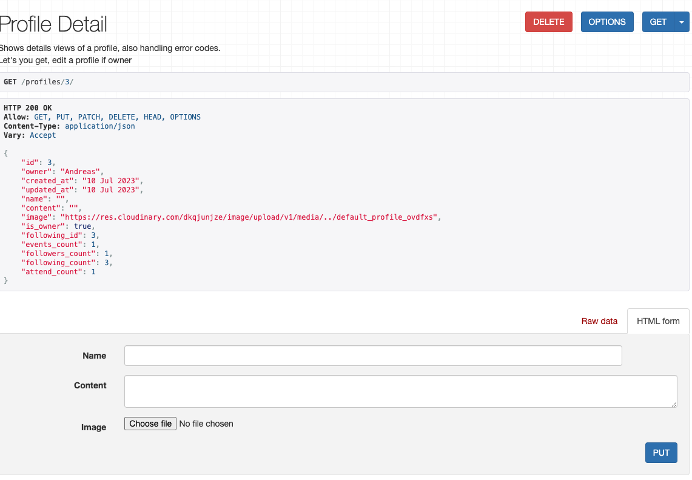
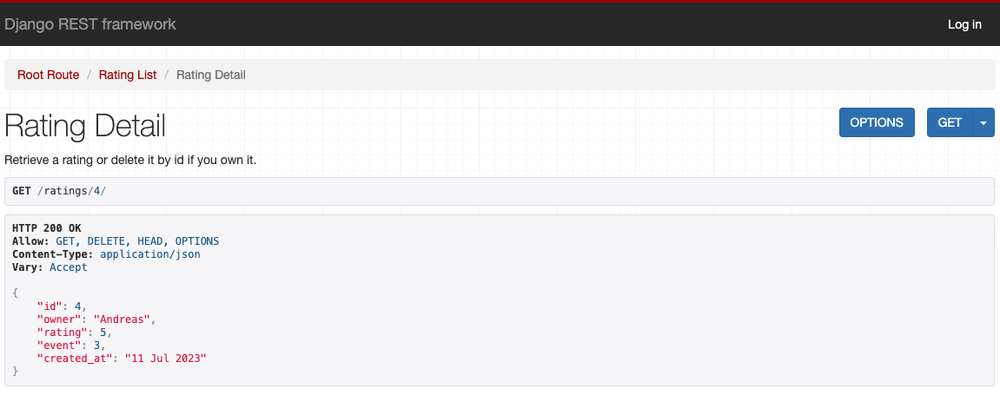

# Milestone project 5 Backend

## Table of Contents

- [Objective](#objective)
- [Links to Deployed Project](#links-to-deployed-project)
- [User Stories and Tasks](#user-stories-and-tasks)
- [Database Design](#database-schema)
- [Models](#models-used-in-this-project-and-the-datafields)
- [Features](#features)
    - [Homepage](#homepage)
    - [Profile Data](#profile-data)
    - [Events Data](#events-data)
    - [Reviews Data](#reviews-data)
    - [Attending Data](#attending-data)
    - [Ratings Data](#ratings-data)
    - [Followers Data](#followers-data)
- [Agile Workflow](#agile-workflow)
- [Testing](#testing)
- [Technologies Used](#technologies-used)
- [Deploying with Heroku](#deploying-with-heroku)
- [Credits](#credits)

## Objective
Explore Sthlm, the website for people living in the capital city of Sweden but also tourists who are here for a visit. Stockholm is renowned for its vibrant cultural scene and dynamic events, and now you can stay connected with all the happenings in one convenient platform.

The website allows users to explore a diverse range of events taking place across the city. From music concerts and art exhibitions to sports tournaments and food festivals, there's always something exciting to discover. With a user-friendly interface and powerful search options, finding events that match your interests has never been easier.

Not only can you explore events, but you can also share and promote your events to a broader audience. Whether organizing a small gathering or a large-scale festival, Explore Sthlm offers a space to showcase your event details and attract attendees.

Engage with fellow event-goers by commenting/reviewing, rating, and sharing your favorite events. Connect with like-minded individuals, share recommendations, and build a vibrant community of event enthusiasts.

[Back to Top](#top)

## Links to Deployed Project

[Back to Top](#top)

## User Stories and Tasks
- All User Storys for this backend API project. These are also in my project on GitHub that I made for this [project.](https://github.com/users/andreas-ka/projects/8)
- I have used Iterations in this project and all iterations 1 and 2 for the backend are visibile in my frontend repository.

### Profile
- [x] As a developer/superuser I can view a list of profiles to see all created profiles. [#1](https://github.com/andreas-ka/explore-sthlm-api/issues/1)        
- [x] As a developer/superuser, I can view the details of one profile to see individual profile data. [#2](https://github.com/andreas-ka/explore-sthlm-api/issues/2)       
- [x] As a developer/superuser I can edit a profile when logged in to update my personal information. [#3](https://github.com/andreas-ka/explore-sthlm-api/issues/3)      
- [x] As a developer/superuser I can delete a profile i own* so that I remove my account from the API. [#4](https://github.com/andreas-ka/explore-sthlm-api/issues/4)      
- [x] As a developer/superuser I can login and logout so that I can edit and delete data i have created. [#9](https://github.com/andreas-ka/explore-sthlm-api/issues/9)       

### Events
- [x] As a developer/superuser I can view a list of all events so that I can see all events gathered in one view. [#5](https://github.com/andreas-ka/explore-sthlm-api/issues/5)       
- [x] As a developer/superuser I can view a single event so that I can see more details about that specific event. [#6](https://github.com/andreas-ka/explore-sthlm-api/issues/6)    
- [x] As a developer/superuser I can edit an event i own so that I can add or remove information. [#7](https://github.com/andreas-ka/explore-sthlm-api/issues/7)      
- [x] As a developer/superuser I can delete an event i own so that I can delete data from the API. [#8](https://github.com/andreas-ka/explore-sthlm-api/issues/8)         
- [x] As a developer/superuser I can create a new event so that I can share my events on the website. [#10](https://github.com/andreas-ka/explore-sthlm-api/issues/10)        

### Reviews
- [x] As a developer/superuser I can review an event so that I can tell the owner my opinions.  [#11](https://github.com/andreas-ka/explore-sthlm-api/issues/11)    
- [x] As a developer/superuser I can view reviews on events so that I can see what other users thinks. [#12](https://github.com/andreas-ka/explore-sthlm-api/issues/12)    
- [x] As a developer/superuser I can edit my review so that I can update or remove information. [#13](https://github.com/andreas-ka/explore-sthlm-api/issues/13)    
- [x] As a developer/superuser I can delete my review so that I can remove my data from the API. [#14](https://github.com/andreas-ka/explore-sthlm-api/issues/14)       

### Attend
- [x] As a developer/superuser I can click on attend on events so that I can show the owner im interested. [#15](https://github.com/andreas-ka/explore-sthlm-api/issues/15)     
- [x] As a developer/superuser I can change my attend status so that I can show the owner if i cant attend anymore. [#16](https://github.com/andreas-ka/explore-sthlm-api/issues/16)      

### Follow and Followed
- [x] As a developer/superuser I can follow so that I can follow a specific user. [#17](https://github.com/andreas-ka/explore-sthlm-api/issues/17)    
- [x] As a developer/superuser I can see all my or others followers so that I can see mine others information. [#18](https://github.com/andreas-ka/explore-sthlm-api/issues/18)     
- [x] As a developer/superuser I can stop following a user if i dont want to follow anymore. [#19](https://github.com/andreas-ka/explore-sthlm-api/issues/19)     

### Rating
- [x] As a developer/superuser I can rate specific events so that I can show the owner what i think. [#20](https://github.com/andreas-ka/explore-sthlm-api/issues/20)     
- [x] As a developer/superuser I can edit my rating of a event so that I can have the option if i change my mind. [#21](https://github.com/andreas-ka/explore-sthlm-api/issues/21)    
- [x] As a developer/superuser I can remove my rating of a event so that I can remove the data from the API. [#22](https://github.com/andreas-ka/explore-sthlm-api/issues/22)     

[Back to Top](#top)

## Database Schema
    

[Back to Top](#top)

## Models used in this project and the datafields.

## Event model

owner = models.ForeignKey(User, on_delete=models.CASCADE)   
created_at = models.DateTimeField(auto_now_add=True)    
updated_at = models.DateTimeField(auto_now=True)    
title = models.CharField(max_length=255, blank=False)   
description = models.TextField(blank=False)   
start_date = models.DateField(blank=False)
end_date = models.DateField(blank=False)       
category = models.CharField(max_length=255, blank=False)    
event_location = models.CharField(max_length=255, blank=False)    
cost = models.DecimalField(max_digits=8, decimal_places=2)    
image = models.ImageField()    

## Profile model

owner = models.OneToOneField(User, on_delete=models.CASCADE)    
created_at = models.DateTimeField(auto_now_add=True)    
updated_at = models.DateTimeField(auto_now=True)    
name = models.CharField(max_length=255, blank=True)   
content = models.TextField(blank=True)    
image = models.ImageField()    

## Rating model

rating = models.IntegerField()    
event = models.ForeignKey(Event, on_delete=models.CASCADE, related_name='ratings')    
owner = models.ForeignKey(User, on_delete=models.CASCADE)   
created_at = models.DateTimeField(auto_now_add=True)  

## ~~Review model~~ ( not implemented)
- A model i have kept for future updates, due to time constraints i have not had the opportunity to implement it for now.

~~owner = models.ForeignKey(User, on_delete=models.CASCADE)~~    
~~review = models.ForeignKey(Event, on_delete=models.CASCADE)~~    
~~created_at = models.DateTimeField(auto_now_add=True)~~     
~~updated_at = models.DateTimeField(auto_now=True)~~     
~~body = models.TextField(blank=False)~~      
~~social_media = models.TextField()~~      

## Followers model

owner = models.ForeignKey(User, related_name='following', on_delete=models.CASCADE)     
followed = models.ForeignKey(User, related_name='followed', on_delete=models.CASCADE)     
created_at = models.DateTimeField(auto_now_add=True)     

## Attend model

owner = models.ForeignKey(User, on_delete=models.CASCADE)    
event = models.ForeignKey(Event, related_name='attend', on_delete=models.CASCADE)    
created_at = models.DateTimeField(auto_now_add=True)   

[Back to Top](#top)

## Features

### Homepage.    
- Landing page on the API.   
    

### Profile Data.   
- Shows the profiles list, profile details and the edit/delete profile page.   
   

      

### Events Data.   
- Shows the events list page, details about an event and also the edit/delete events page if you own the event.   
    

       

### Reviews Data.    
- First image is the reviews list, second the details about the review and finally the third the edit/delete view of the review.
   
    
   

### Attending Data.    
- Shows the attending list and also the edit/delete view on the second image.    
    
   

### Ratings Data.   
- First image is of the ratings list, second the details about the rating, third the edit/delete view.
    
   
   

### Followers Data.   
- Followers list, second image is of the followers detail view and lastly the edit/delete followers view.   
   
   
   

[Back to Top](#top)

## Agile Workflow
### Github Project Board
I utilized the Kanban project board on GitHub to develop this API using Agile principles right from the start. The project board allowed me to create user stories that were guidelines for me to follow and test during the development process.

To effectively manage the project, I created a Milestone for each app (model) I developed. These milestones helped me outline the individual sprints of the project. Within each milestone, I included the relevant user stories for the developers to work on. By adopting this approach, I ensured a structured and iterative development process.
    
   

[Back to Top](#top)

## Testing
I refer to [TESTING.md](/TESTING.md) for all my tests in this project.

## Technologies Used

- ### Languages
    - Python

- ### Framework
    - Django Rest Framework

- ### Packages Used
    - cloudinary
    - cloudinary-storage
    - Pillow
    - django-rest-framework
    - dj-rest-auth
    - django-filter
    - django-allauth
    - PyJWT
    - psycopg2
    - gunicorn
    - datetime

- ### Programs and tools
    - drawSQL
    - GitPod for development
    - GitHub to store project
    - Heroku.com
    - Cloudinary.com

- ### Modules in GitPod Used
    - Prettier
    - eslint

[Back to Top](#top)

## Deploying with Heroku

It's a prerequisite that you have Cloudinary account before deployment.
A Cloudinary account, create one for free at https://cloudinary.com.

1. Log in to Heroku; if not taken there automatically, navigate to your personal app dashboard.
2. At the top of the page, locate the 'New' drop-down, click it and then select 'Create new app.'
3. Give your application a unique name, select a region appropriate to your location and click the 'Create app' button.
4. Your app should now be created, so from the menu towards the top of the page select the 'Resources' section.
5. Search for 'Heroku Postgres' under the Add-ons section and add it.
6. From the menu towards the top of the page select the 'Settings' section and lick 'Reveal Config Vars' in the Config vars section. Enter the following key / value pairings:
- Key as ALLOWED_HOSTS and the value as the name of you project with '.herokuapp.com' appended to the end e.g. example-app.herokuapp.com. Click the Add button.
- Key as CLOUDINARY_URL and the value as your cloudinary API Environment variable e.g. cloudinary://**************:**************@*********. Click the Add button.
- Key as SECRET_KEY and the value as a complex string which will be used to provide cryptographic signing. The use of a secret key generator is recommended.
- Ensure the key DATABASE_URL is already populated. This should have been created automatically by Heroku.
- To make authenticated requests to this API (e.g. from a fontend application) you are required to add the key CLIENT_ORIGIN with the value set as the URL you will be sending the authentication request from.
- CLIENT_ORIGIN_DEV key can be set with the value of a development server (IP or URL) for use during local development.
7. Open the .env file in the project directory and delete the key / value pair DEV_ENVIRONMENT_DATABASE = True before saving the file. This can be added back after the next step to ensure local development changes will not alter the remote database.
8. Navigate to the 'Deploy' page using the menu towards the top of the page.
9. Select 'GitHub' from the 'Deployment method' section and you will be prompted to 'Connect to GitHub'.
10. Once connected to your GitHub account you will be able to search for your repository which contains the forked 'property-direct-backend' repository.
11. Once the repository is found click 'Connect'.
12. At the bottom of the page find the section named 'Manual deploy', select the 'main' branch in the drop down and click the 'Deploy' button.
13. Once deployment is complete, click the 'View' button to load the URL of the deployed application.

#### You can for fork the repository by following these steps:

1. Go to the GitHub repository.   
2. Click on Fork button in upper right hand corner.   
3. Wait for the forking process to complete. Once done, you will have a copy of the repository in your GitHub account.    

#### You can clone the repository by following these steps: 

1. Go to the GitHub repository.   
2. Locate the Code button above the list of files and click it.   
3. Select your preferred method for cloning: HTTPS, SSH, or GitHub CLI, and click the copy button to copy the repository URL to your clipboard.   
4. Open Git Bash (or your preferred terminal).   
5. Change the current working directory to the location where you want the cloned directory to be created.   
6. Type the command **'git clone'** followed by the URL you copied in step 3. The command should look like this: **git clone https://github.com/YOUR-USERNAME/YOUR-REPOSITORY**.    
7. Press Enter to create your local clone.   

## Credits
- My awesome wife Sandra, a professional copywriter, helped me with the Objective text.
- *HUGE* credit to Code Institute and their tutorial on how to build an API; loads of code from that.    
- My Mentor @CluelessBiker for awesome support and feedback.

[Back to Top](#top)