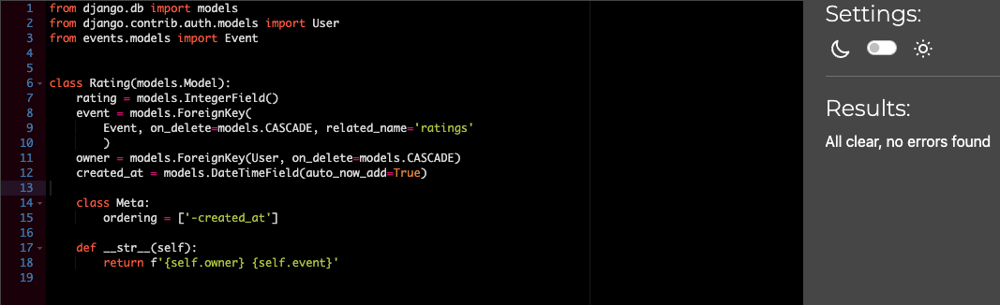

## Testing for explore_sthlm_api
Back to [README.md](/README.md)

## Manual Testing 

### Profiles
[x]	Profile automatically created on user creation.  
[x]	Can list profiles.   
[x]	Can retrieve profile using valid ID.    
[x]	Can't retrieve profile using invalid ID.    
[x]	Can update own profile.   
[x]	Can't update someone else's profile.   
[x]	Can delete own profile.    
[x]	Can't delete someone else's profile.   

### Events
[x]	Can list events.   
[x]	Logged out user can't create event.   
[x]	Logged in user can create event.   
[x]	Can retrieve event using valid ID.   
[x]	Can't retrieve event using invalid ID.   
[x]	Can update own event.   
[x]	Can't update someone else's event.    
[x]	Can delete own event.   
[x]	Can't delete someone else's event.   

### Reviews
[x]	Can list reviews.   
[x]	Logged out user can't create review.   
[x]	Logged in user can create review.   
[x]	Can retrieve review using valid ID.   
[x]	Can't retrieve review using invalid ID.   
[x]	Can update own review.   
[x]	Can't update someone else's review.    
[x]	Can delete own review.   
[x]	Can't delete someone else's review.   

### Followers
[x]	Can list followers.   
[x]	Logged out user can't follow.   
[x]	Logged in user can follow.  
[x]	Can retrieve followers using valid ID.   
[x]	Can't retrieve followers using invalid ID.   
[x]	Can delete follow from my own profile.   
[x]	Can't delete someone else's follow.   
[x]	Can't follow the same profile twice.   

## PEP8
All files has been trough CI´s own Python Linter that can be found [here](https://pep8ci.herokuapp.com/)

### Attending

### Events

### Explore_sthlm_api

### Followers

### Profiles

### Ratings

### Reviews

Back to [README.md](/README.md)