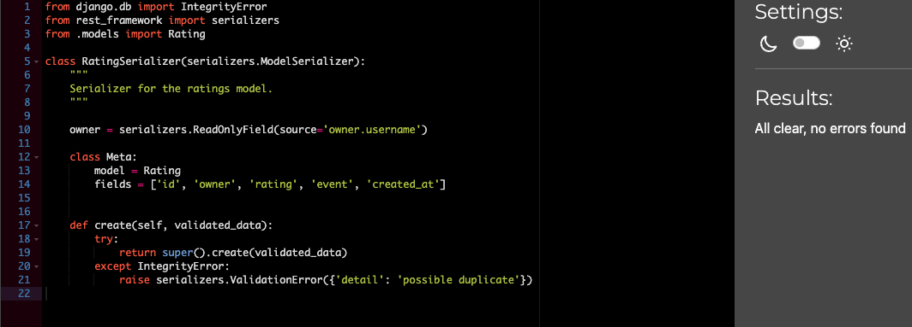

## Testing for explore_sthlm_api
Back to [README.md](/README.md)

### Manual Testing on the frontend and backend i have done.

All manual testing can be found in this Google Sheet found [here](https://docs.google.com/spreadsheets/d/1SI37C_QfKiTO75sShmg1B0r8Dor87qpLhmL8UYKBUsI/edit?usp=sharing)     

- Example from testing sheet below.   

## PEP8
All files has been trough CI´s own Python Linter that can be found [here](https://pep8ci.herokuapp.com/)

### Attending

### Events

### Explore_sthlm_api

### Followers

### Profiles

### Ratings

### Reviews

Back to [README.md](/README.md)